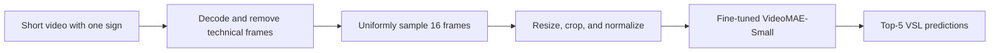

# Vietnamese Sign Language Recognition

VideoMAE-based classification of 100 isolated Vietnamese Sign Language (VSL)
signs, with a reproducible training pipeline, audited validation split, and
interactive Streamlit inference.

## Results

| Evaluation set | Videos | Top-1 accuracy | Top-5 accuracy | Macro-F1 |
|---|---:|---:|---:|---:|
| Full held-out validation | 812 | **87.19%** | **96.31%** | **82.14%** |
| Audited subset | 808 | **87.62%** | **96.66%** | **82.45%** |

The checkpoint was selected at epoch 27 using validation macro-F1. These are
single-run internal validation results, not an official competition test score.
Machine-readable metrics and detailed error analysis are available in the
[evaluation report](reports/RESULTS.md).

### Runtime benchmark

On the local Windows CPU with PyTorch 2.5.1, batch-1 model inference averaged
**626 ms** across 50 runs (median 628 ms, p95 823 ms). Video decoding and
preprocessing averaged 36 ms per clip. Hardware and package versions are stored
with the metrics so these numbers are not presented as device-independent.

## Why the audited subset?

The recovered manifests contain no exact filename overlap and no overlap after
grouping source filename variants. A perceptual-signature audit found two
cross-split groups:

- the same visual sequence appears under conflicting labels in train and
  validation;
- one training clip and three validation clips contain only solid-colour
  technical frames.

The complete result is retained for reproducibility. The audited subset removes
the four affected validation files and is reported separately rather than
silently changing the original split. See [DATASET_CARD.md](DATASET_CARD.md)
for details.

## System



- **Backbone:** VideoMAE-Small initialized from Kinetics-400 weights
- **Input:** 16 RGB frames at 224 × 224
- **Training:** AdamW, cosine schedule, label smoothing, weighted sampling
- **Primary metric:** macro-F1 due to class imbalance
- **Demo:** video upload with top-5 probabilities and latency

## Quick start

Python 3.10 or 3.11 is recommended.

```bash
git clone https://github.com/khanghoang123/vsl-recognition.git
cd vsl-recognition
python -m venv .venv

# Windows
.venv\Scripts\activate

# macOS/Linux
source .venv/bin/activate

pip install -e ".[app]"
```

Place the local model bundle at:

```text
models/videomae_olympic_best/
├── class_names.json
├── config.json
├── model.safetensors
└── preprocessor_config.json
```

Then launch the app:

```bash
streamlit run app.py
```

Set `VSL_MODEL_DIR` to use a different model location.

## Reproduce the audit and evaluation

The raw dataset and checkpoint are intentionally excluded from Git.

```bash
python -m vsl_recognition.audit \
  --metadata-dir /path/to/metadata \
  --data-root /path/to/dataset/train \
  --model-dir /path/to/model \
  --output reports/data_audit.json

python -m vsl_recognition.evaluate \
  --model-dir /path/to/model \
  --metadata /path/to/metadata/val.json \
  --data-root /path/to/dataset/train \
  --audit reports/data_audit.json \
  --output-dir reports
```

Training uses the same importable preprocessing code:

```bash
python -m vsl_recognition.train \
  --config configs/videomae_small.json \
  --metadata-dir /path/to/metadata \
  --data-root /path/to/dataset/train \
  --output-dir models/videomae_olympic_best
```

## Repository structure

```text
.
├── app.py                  # Streamlit demo
├── configs/                # Versioned experiment configuration
├── docs/                   # Methodology and limitations
├── reports/                # Audits, metrics, figures, and predictions
├── src/vsl_recognition/    # Training, evaluation, and inference package
└── tests/                  # Fast tests that do not need the dataset/model
```

## Scope and limitations

This project classifies one isolated sign per clip. It does not perform
continuous sign spotting or sentence translation. Webcam performance can be
lower than validation performance because of background, lighting, framing,
motion blur, and gesture-boundary shift.

Read the [model card](MODEL_CARD.md), [dataset card](DATASET_CARD.md), and
[limitations](docs/limitations.md) before reusing the system.

## License and attribution

Source code is released under MIT. The upstream VideoMAE checkpoint is
CC BY-NC 4.0, so fine-tuned model weights are a separate non-commercial
artifact. The Olympic AI 2025 dataset is not redistributed. See
[THIRD_PARTY_NOTICES.md](THIRD_PARTY_NOTICES.md).
