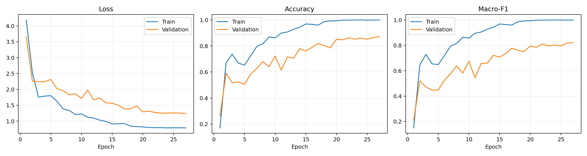
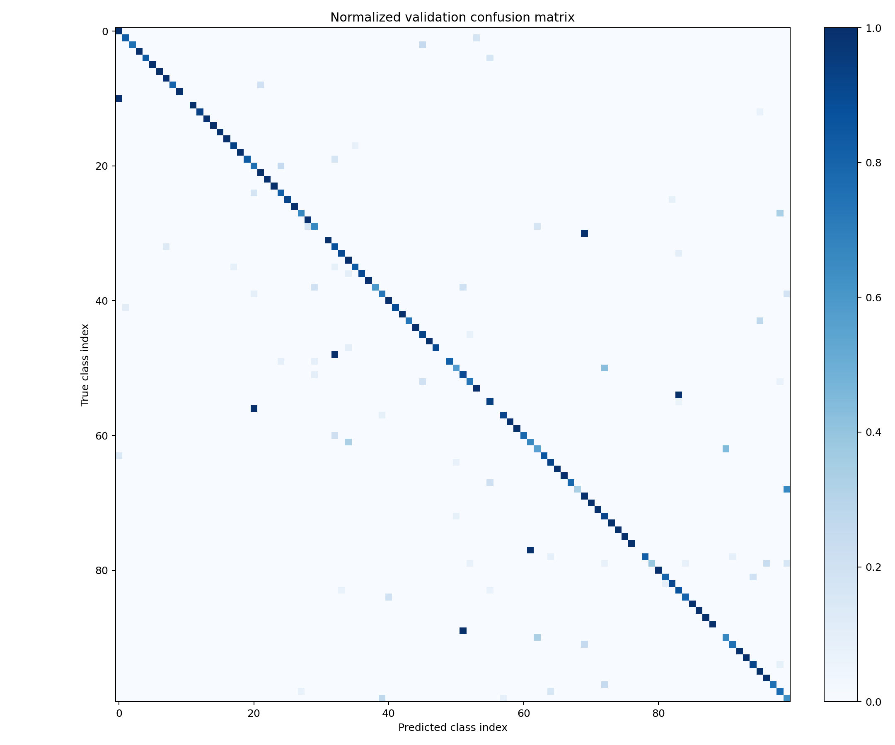

# Evaluation results

## Summary

| Evaluation set | Videos | Top-1 accuracy | Top-5 accuracy | Macro-F1 |
|---|---:|---:|---:|---:|
| Full held-out validation | 812 | 87.19% | 96.31% | 82.14% |
| Audited subset | 808 | 87.62% | 96.66% | 82.45% |

The audited subset excludes four validation artifacts identified by the
perceptual-signature audit. The complete split remains the primary
reproducibility result.

## Performance by class support

Classes were divided using the lower and upper quartiles of the full dataset
class-count distribution.

| Support band | Classes | Mean per-class F1 |
|---|---:|---:|
| Tail: 6–15 videos | 25 | 67.33% |
| Body: 16–58 videos | 49 | 86.61% |
| Head: 59+ videos | 26 | 87.93% |

The 20-point gap between tail and head classes is the clearest remaining model
quality issue.

## Error analysis

Seven classes have zero validation F1: `Bệnh nhân`, `Cơ thể`, `Lo lắng`,
`Ngón tay`, `Nhầm`, `Xe máy`, and `Thương`. Six of these have only one
validation example; `Thương` has four.

The most frequent directional confusions are:

| Target | Predicted | Errors |
|---|---|---:|
| Ô tô | Xe đạp | 4 |
| Nôn ói | Ghét | 4 |
| Thương | Nôn ói | 4 |
| Ăn | Khóc | 3 |
| Thức dậy | Đầu | 3 |
| Khai báo | Đâu | 3 |
| Nói xấu | Dạy dỗ | 3 |
| Chậm lại | Chào | 3 |

The `Chậm lại`/`Chào` pair is also affected by a conflicting-label duplicate
found during the data audit.

## Runtime

Evaluation was reproduced locally with PyTorch 2.5.1 on CPU.

- Batch-1 model inference: 626 ms mean, 628 ms median, 823 ms p95
- Video decoding and preprocessing: 36 ms mean per clip
- Parameters: 21,918,436
- Checkpoint size: 87,695,864 bytes

Runtime values depend on hardware and should not be compared without matching
the environment in `metrics.json`.

## Figures

